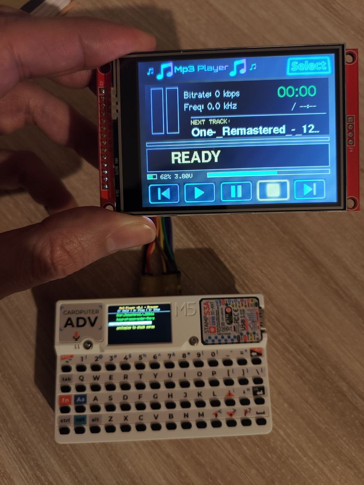

# 🎵 Mp3 Player for Cardputer-Adv (Dual Screen) - v0.2

A robust audio player for the **M5Stack Cardputer-Adv** featuring a custom GUI on an external 240x320 **ILI9341** screen (partial support for ILI9488@480x320), with fallback support for the internal display. Features SD card file navigation (with subdirectory support), MP3/FLAC playback, and persistent settings.

## 🙏 Credits & Inspiration

This project is a heavy modification and evolution of existing works by the M5Stack community.

* **Base Code:** Adapted from [M5Mp3 Winamp Player for Cardputer-Adv](https://github.com/AndyAiCardputer/mp3-player-winamp-cardputer-adv) by **AndyAiCardputer** (originally based on **VolosR**'s work).
* **Dual Screen Inspiration:** Heavily inspired by the work done on the [ZX Spectrum Cardputer External Display](https://github.com/AndyAiCardputer/zx-spectrum-cardputer-external/discussions/2), which provided the foundation for the HSPI external display implementation.
* **AI Co-Authors:** All code logic, refactoring, and graphic assets (stored as C++ Hex Arrays) were generated/assisted by **ChatGPT** and **Gemini Pro**.

## 📸 Screenshots

## ✨ Features

* ✅ **Dual Screen Support** - Renders a custom high-res GUI on an external ILI9341 (320x240) while showing status text on the internal ST7789 screen (see 0.2 changelogs for ILI9488 support).
* ✅ **Headless Mode** - If no external display is connected, the player remains fully functional using the internal screen text interface.
* ✅ **Format Support** - Plays both **MP3** and **FLAC** files.
* ✅ **ES8311 Codec** - Native support for the Cardputer-Adv internal audio codec via `M5Cardputer.Speaker`.
* ✅ **Advanced Navigation** - Full support for **Subdirectories** and deep folder structures.
* ✅ **Persistence** - Automatically saves the last playback position and current directory to the SD card (`/player` folder). It resumes exactly where you left off after a reboot.
* ✅ **Queue Visibility** - Displays the currently playing track and highlights the next track in the list.
* ✅ **Multithreading** - Utilizes ESP32 dual-core capabilities (FreeRTOS) to separate UI rendering (Core 0) from Audio decoding (Core 1) for stutter-free playback.
* ✅ **Battery Indicator** - Real-time voltage reading on the UI.

## 🔧 Hardware Configuration

This project is specifically designed and tested on the **M5Stack Cardputer Adv**.

### 📺 External Display Setup (ILI9341 and ILI9488)

To avoid conflicts between the internal SD Card and the external display on the default SPI bus, this project uses a **custom pin mapping** on the HSPI bus.

**Wiring for ILI9341 (320x240) and ILI9488 (480x320):**

| ILI9341 Pin | Cardputer GPIO | Note |
| :--- | :--- | :--- |
| **MISO** | **Disconnected** | Not used to prevent bus contention |
| **CS** | **GPIO 5** | Chip Select |
| **DC** | **GPIO 6** | Data/Command |
| **RST** | **GPIO 3** | Reset |
| **SCLK** | **GPIO 15** | Clock (Modified from standard) |
| **MOSI** | **GPIO 13** | Data (Modified from standard) |

## 💾 SD Card Setup

1.  Format your SD card as **FAT32**.
2.  **IMPORTANT:** Copy the contents of the `SDFiles` folder (found in this repository) to the **root** of your SD card. This ensures the system folder structure is ready.
3.  Add your music files (`.mp3`, `.flac`) to the root or organize them into any subfolders you like.

## 🎮 Controls

The controls are optimized for the Cardputer keyboard:

| Key | Function |
| :--- | :--- |
| `A` | **Play / Pause** ▶️⏸️ |
| `S` | **Stop** ⏹️ |
| `V` | **Volume Cycle** 🔊 (Cycles through levels) |
| `,` | **Scroll Up / Previous File** ⬆️ |
| `.` | **Scroll Down / Next File** ⬇️ |
| `ENTER`| **Select** (Play File or Open Directory) ↵ |
| `ESC` | **Help / Back** (Show on-screen help) |

## 📝 Technical Details

### Architecture
The system leverages the ESP32's dual cores to ensure high-quality audio streaming while maintaining a responsive UI.
* **Core 0:** Handles the User Interface (TFT drawing on ILI9341), input handling, and file browsing.
* **Core 1:** Dedicated strictly to Audio Decoding (MP3/FLAC) and feeding the I2S/ES8311 pipeline to prevent audio glitches during screen refreshes.

### Graphics & Assets
To keep the file system clean and the UI fast, all graphical assets (Logos, Buttons, Codec Icons) are converted into C++ Hex Arrays and stored directly in the firmware via `Logo.h` and `Buttons.h`. No external image files are needed on the SD card for the UI.

### State Saving
The player automatically creates a hidden system folder named `/player` on your SD card. It stores a `last_pos.txt` file here, ensuring persistence across power cycles.

## 📦 Required Libraries

Ensure you have the following installed via PlatformIO or Arduino Library Manager:

1.  **ESP8266Audio** (by Earle Philhower) - For MP3/FLAC decoding.
2.  **M5Cardputer** / **M5Unified** - For hardware abstraction.
3.  **TFT_eSPI** - For driving the external display (configured for HSPI).

## 📄 License

This project shares the same license as the original [M5Mp3 project](https://github.com/VolosR/M5Mp3).

---

*Disclaimer: This software is provided "as is" without warranty of any kind. Please double-check your wiring before powering on the device to avoid damaging your Cardputer or external display.*

## [v0.2.0] - Dual Core & High-Res Display Support

This release introduces significant architectural changes to support larger displays and improve audio stability using the ESP32-S3's dual-core capabilities.

### 🚀 New Features
* **ILI9488 Display Support:** Added native driver support for 480x320 external displays.
    * Includes a dedicated, optimized UI layout ("Tuned Layout") for the higher resolution.
    * Features a "Dark Mode" footer and a larger marquee area (34px height).
* **Dual-Core Architecture:** * **Core 0:** Now dedicated to the `Task_Audio` (decoding and playback).
    * **Core 1:** Handles the UI rendering and User Inputs.
    * This separation helps mitigate SPI bus contention between the SD Card and the Display.
* **Dynamic Sample Rate:** The audio engine now detects and switches sample rates automatically (supporting 44.1kHz, 48kHz, etc.).

### 🛠 Improvements
* **Smart Yielding:** Implemented a smart delay logic in the audio loop to balance CPU load between heavy FLAC decoding and UI responsiveness.
* **Unified Metadata:** Both display versions now consistently show Bitrate and Frequency information.

### ⚠️ Performance Note: FLAC on ILI9488
Please note a performance distinction between display models due to hardware limitations (SPI Bandwidth/CPU):

* **Standard ILI9341 (320x240):** FLAC playback is seamless with instant UI updates.
* **High-Res ILI9488 (480x320):** * FLAC decoding combined with pushing 153,600 pixels over SPI is extremely resource-intensive.
    * **Mitigation:** When loading a FLAC file on the 9488, the UI enters a temporary "Graphic Lock" state with an 800ms pre-buffering silence. This ensures the audio buffer is full before the screen turns on, preventing audio stuttering.
    * **FLAC playback still does not work**, any help is appreciated!!
    * *MP3 playback remains unaffected and performs smoothly on both screens.*

### 🐛 Bug Fixes
* Fixed SPI conflicts causing system freezes during track change.
* Fixed UI flickering by implementing state-check rendering for buttons and headers.
